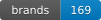

  
  
  
  
  

# Open Filament Database

An open, community-maintained database of 3D-printing filaments — brands, materials, filament product lines, colour variants, spool sizes, and the stores that sell them. Hosted by the **Open Filament Collective**, currently facilitated by SimplyPrint.

The data is free to use under MIT — slicers, print farm software, NFC spool tags ([OpenPrintTag](https://specs.openprinttag.org/)), inventory apps, and price-comparison tools can all read it directly.

---

## ✍️ Contributing

The fastest way to add, fix, or correct data is the cloud editor — no install required:

> 👉 **<http://openfilamentdatabase.org/>**

Browse brands → materials → filaments → variants → sizes, edit fields, upload logos, and submit your changes as a pull request straight from the browser. The editor validates schema, logos, and store references in-page before submitting, so most mistakes are caught up front.

You can sign in two ways:

- **GitHub** — your edits become a pull request opened **from your own fork**, attributed to you on your GitHub profile.
- **SimplyPrint** — your edits become a pull request opened by our **bot account**, with attribution back to you in the PR body. No GitHub account needed. Rate-limited per IP (default 5 submissions/hour).

### Editing locally instead

If you'd rather work from a clone — for offline edits, running the Python validator against your own data, bulk imports, or developing the WebUI itself — see [docs/contributing-locally.md](docs/contributing-locally.md). For editing JSON files by hand without the WebUI, see the [manual editing guide](docs/manual.md).

---

## 🔌 Using the data (API)

The full dataset is published as a static REST API, with bulk JSON / NDJSON / SQLite / CSV downloads alongside it. The landing page documents the URL shape, endpoints, and examples:

> 👉 **<https://api.openfilamentdatabase.org/>**

Address entities by **path**, e.g. `/api/v1/brands/{brand}/materials/{MATERIAL}/filaments/{filament}/variants/{variant}.json`.

Filaments are also published as **ready-to-import [OrcaSlicer presets](docs/orcaslicer.md)** — per filament, or per brand as a zip. Download one and import it with File → Import → Import Configs.

> ℹ️ UUID-based lookups are still supported for integrations that need stable opaque identifiers (NFC tags, slicer profiles), but path-based addressing is what we recommend for everyone else — it's human-readable and stable across cosmetic renames.

---

## 📚 More documentation

- [WebUI guide](docs/webui.md) — features, modes, configuration
- [OrcaSlicer guide](docs/orcaslicer.md) — downloading and importing the generated filament presets
- [Manual editing guide](docs/manual.md) — editing JSON files by hand
- [Validation guide](docs/validation.md) — running the validator, understanding errors
- [Local contributing guide](docs/contributing-locally.md) — full fork → clone → PR walkthrough
- [Pull request guide](docs/pull-requesting.md) — opening a PR from your fork
- [Software installation](docs/installing-software.md) — Git, Python, Node.js setup (local route only)

---

## 📜 License

MIT. See [`LICENSE`](LICENSE). The data is free to use, redistribute, and embed in commercial products; attribution is appreciated but not required.

---

## 🔗 Related projects

- [OpenPrintTag spec](https://specs.openprinttag.org/) — NFC data format that consumes OFD UUIDs
- [`slicer-profiles-db`](https://github.com/SimplyPrint/slicer-profiles-db) — separate repo mapping OFD filaments to slicer profiles
- [SimplyPrint](https://simplyprint.io/) — 3D printer management platform; facilitator of the Open Filament Collective
