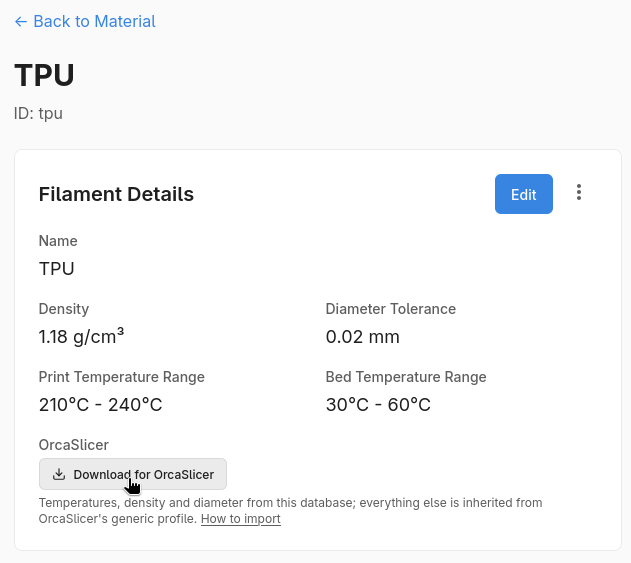
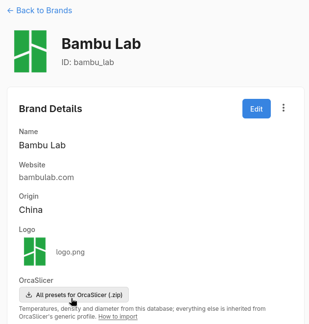
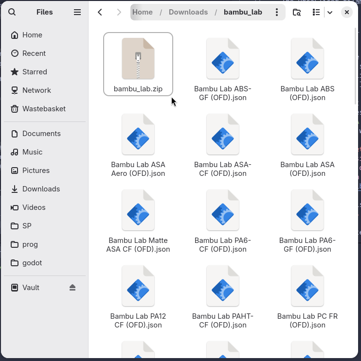
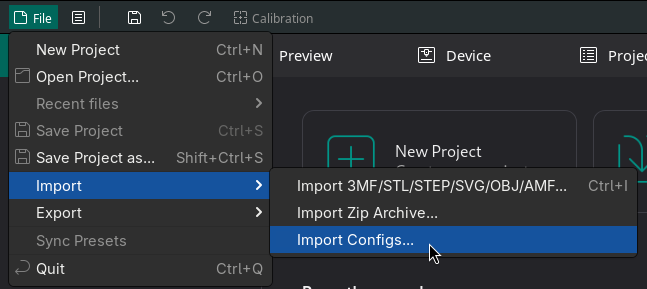
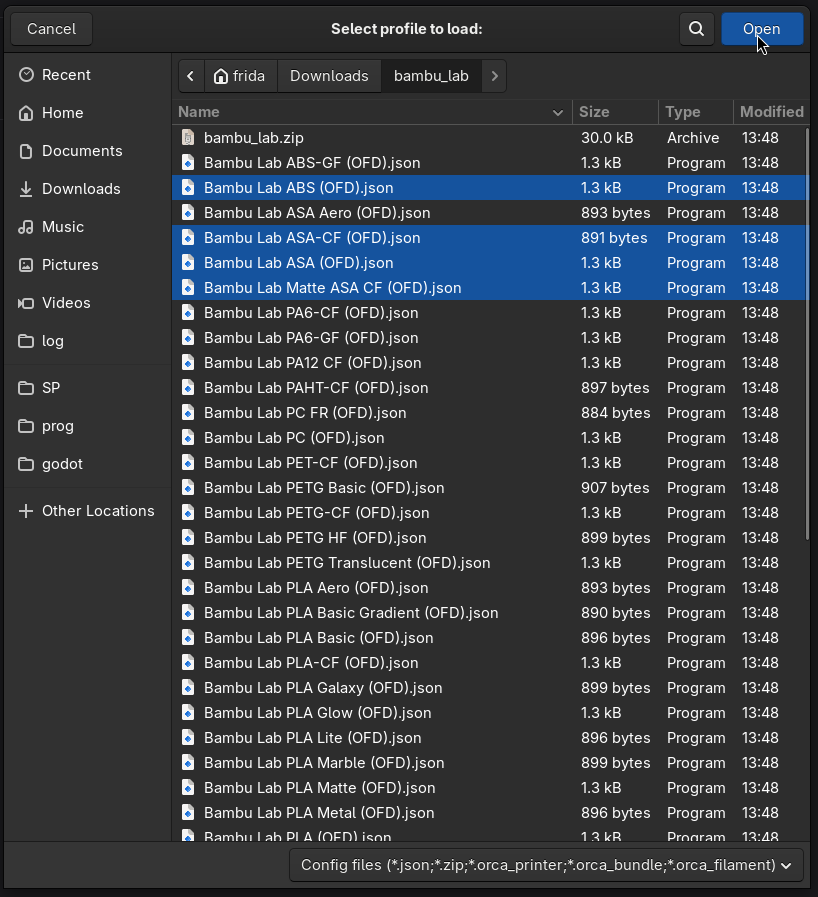
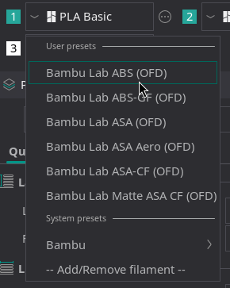
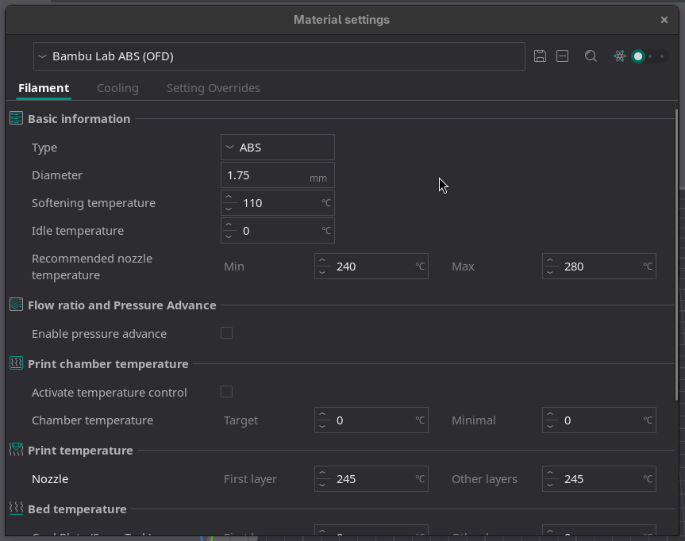
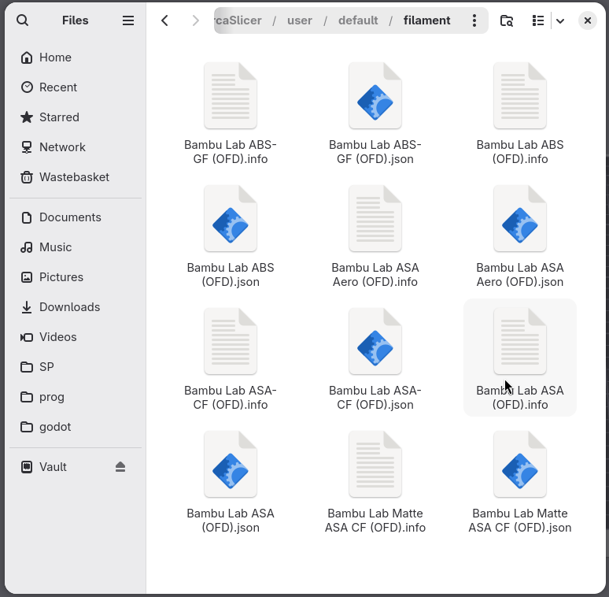
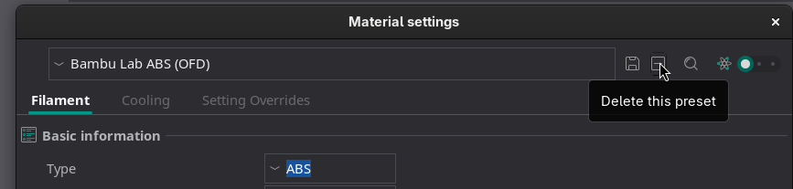

# OrcaSlicer Filament Presets

Every filament in the Open Filament Database is published as a ready-to-import **OrcaSlicer filament preset**. Download one filament, or a whole brand as a zip, and import it — no plugin, no account, no build of OrcaSlicer required.

---

## Table of Contents

- [What you get — and what you don't](#what-you-get--and-what-you-dont)
- [Download one filament](#download-one-filament)
- [Download a whole brand](#download-a-whole-brand)
- [Import into OrcaSlicer](#import-into-orcaslicer)
- [Manual install](#manual-install)
- [Where the values come from](#where-the-values-come-from)
- [Improving a preset](#improving-a-preset)
- [Removing the presets](#removing-the-presets)
- [Using the preset index programmatically](#using-the-preset-index-programmatically)

---

## What you get — and what you don't

Read this first. It is the difference between a preset that helps you and one you blame later.

**What OFD sets on the preset:**

- Vendor and material type
- Density and filament diameter
- Nozzle temperature and first-layer nozzle temperature
- Bed temperature and first-layer bed temperature
- Chamber temperature, where the manufacturer publishes one

**What OFD does _not_ set — and cannot:**

- Flow ratio
- Retraction distance and speed
- Maximum volumetric speed
- Fan speeds and cooling
- Pressure advance / linear advance

The database does not record those values for any filament, so the presets do not invent them. Each preset instead **inherits** from OrcaSlicer's matching generic profile (`Generic PLA @System`, `Generic PETG-CF @System`, and so on), and those inherited values are what you get.

> **Treat these presets as a correct starting point, not a tuned profile.** The temperatures and density are the manufacturer's; the print behaviour is OrcaSlicer's generic default for that material. If you care about surface finish or maximum speed, run OrcaSlicer's own [calibration](https://www.orcaslicer.com/wiki/calibration/calibration) flows on top.

Every preset says this in its own notes field, visible in OrcaSlicer under **Filament Settings → Notes → Filament notes**, together with the API URL it was generated from.

Filaments made of materials OrcaSlicer has no generic profile for — PEEK, PEKK, PPS, PPSU, PVDF, PEI, PVB and similar — are **skipped** rather than published against a wrong-behaving parent.

---

## Download one filament

Browse to any filament on <https://openfilamentdatabase.org/> and use the **Download for OrcaSlicer** button in the filament details panel.

<!-- Screenshot: a filament page on openfilamentdatabase.org, with the "Download for OrcaSlicer" button in the Filament Details panel visible. -->


You can also fetch it straight from the API. The URL is the filament's API path with `api/v1` swapped for `orcaslicer`, and `.json` on the end:

```
https://api.openfilamentdatabase.org/orcaslicer/brands/{brand}/materials/{MATERIAL}/filaments/{filament}.json
```

```bash
curl -O "https://api.openfilamentdatabase.org/orcaslicer/brands/add_north/materials/PLA/filaments/pla_economy.json"
```

The material segment is upper-case (`PLA`, `PETG`, `ABS`); brand and filament segments are the lower-case slugs used everywhere else in the API.

---

## Download a whole brand

Each brand page has an **All presets for OrcaSlicer (.zip)** button, and the bundles are directly addressable:

```bash
# One brand
curl -O "https://api.openfilamentdatabase.org/orcaslicer/bundles/sunlu.zip"

# Every brand in one archive
curl -O "https://api.openfilamentdatabase.org/orcaslicer/bundles/all.zip"
```

<!-- Screenshot: a brand page with the "All presets for OrcaSlicer (.zip)" button visible. -->


Each zip contains one `.json` per filament, named exactly as the preset appears in OrcaSlicer, plus a `README.txt` with these install instructions.

<!-- Screenshot: a downloaded brand zip, unzipped in a file manager, showing the .json files and README.txt. -->


> **Unzip it first.** OrcaSlicer's Import Configs reads `.json` files and its own `.orca_filament` bundles — it will not open a plain `.zip`. Extract the archive, then either select the `.json` files in the import dialog (you can multi-select) or copy them straight into the filament folder as described under [Manual install](#manual-install).

> `all.zip` holds roughly two thousand presets. Importing all of them makes for a very long filament dropdown — prefer the brands you actually buy.

---

## Import into OrcaSlicer

1. Open OrcaSlicer and go to **File → Import → Import Configs…**

   <!-- Screenshot: OrcaSlicer with the File > Import menu open, "Import Configs..." highlighted. -->
   

2. Select the `.json` files you downloaded. You can select several at once.

   <!-- Screenshot: the file picker with one or more downloaded OFD preset .json files selected. -->
   

3. The presets now appear in the **Filament** dropdown in the left sidebar of the **Prepare** tab, grouped under **User presets** and each ending in `(OFD)`.

   <!-- Screenshot: the Filament dropdown in the Prepare sidebar, open, showing imported presets under the "User presets" group with the (OFD) suffix. -->
   

4. To check the imported values, select the preset, then click the **edit button next to the Filament dropdown** (its tooltip reads *"Click to edit preset"*). That opens the **Filament Settings** tab.

   - **Filament** page → **Basic information** shows Filament type, Vendor, Density and Diameter; **Print temperature** shows the nozzle and bed temperatures.
   - **Notes** page → **Filament notes** holds the source API URL, the dataset version and the caveat above.

   <!-- Screenshot: the Filament Settings tab, Filament page, showing Basic information (type/vendor/density/diameter) and Print temperature for an imported (OFD) preset. -->
   

### If the import reports "0 imported"

- **You selected a `.zip`.** Import Configs does not read plain zip archives. Extract it and select the `.json` files inside.
- **The preset references a base your OrcaSlicer doesn't have.** Every preset inherits from a `Generic … @System` profile in OrcaSlicer's built-in *OrcaFilamentLibrary*. If your install predates the one it names, update OrcaSlicer.
- **You hand-edited the file.** A user preset must not contain `type`, `instantiation`, `compatible_printers`, `setting_id` or `filament_id` — those mark it as a *system* profile, and OrcaSlicer rejects it silently with exactly this message. See [where the values come from](#where-the-values-come-from) for the envelope these files use.

If a freshly downloaded preset still fails, please [open an issue](https://github.com/OpenFilamentCollective/open-filament-database/issues) with your OrcaSlicer version and the file.

---

## Manual install

Copying the files in directly works just as well and is easier to script. Drop the `.json` files into your OrcaSlicer filament folder, then restart OrcaSlicer:

| OS      | Folder                                                        |
| ------- | ------------------------------------------------------------- |
| Windows | `%APPDATA%\OrcaSlicer\user\default\filament`                   |
| macOS   | `~/Library/Application Support/OrcaSlicer/user/default/filament` |
| Linux   | `~/.config/OrcaSlicer/user/default/filament`                   |

<!-- Screenshot: the user/default/filament folder in a file manager, containing several (OFD) preset files. -->


```bash
# Linux/macOS: install every SUNLU preset in one go
curl -sL https://api.openfilamentdatabase.org/orcaslicer/bundles/sunlu.zip -o sunlu.zip
unzip -o sunlu.zip -x README.txt -d ~/.config/OrcaSlicer/user/default/filament
```

---

## Where the values come from

| OrcaSlicer key                              | Source in the database                                                     |
| ------------------------------------------- | -------------------------------------------------------------------------- |
| `inherits`                                  | The material type, refined by the product name (see below)                 |
| `filament_vendor`                           | `brand.json` → `name`                                                       |
| `filament_type`                             | `material.json` → `material`, where OrcaSlicer recognises the type          |
| `filament_density`                          | `filament.json` → `density`                                                 |
| `filament_diameter`                         | `sizes.json` → `diameter`, only when the whole product line ships in one    |
| `nozzle_temperature`, `..._initial_layer`   | see the fallback chain below                                                |
| `hot_plate_temp`, `textured_plate_temp`, `eng_plate_temp` (and `_initial_layer`) | see the fallback chain below           |
| `chamber_temperature`                       | `filament.json` → `chamber_temperature`                                     |
| `filament_notes`                            | Generated: the inherited base, the source API URL, the dataset version, and the OrcaSlicer filament code OFD has on record |

**The preset envelope.** These are *user* presets, which OrcaSlicer stores in a different shape from the system profiles it ships. Each file carries `name`, `from: "User"`, `inherits`, `is_custom_defined`, `filament_settings_id` and `version`, and deliberately carries **no** `type`, `instantiation`, `compatible_printers`, `setting_id` or `filament_id` — a user preset containing any of those is treated as a system profile and refused on import. `filament_id` in particular is metadata rather than a setting (it is absent from OrcaSlicer's own `fdm_filament_common.json`); the slicer records that linkage in the `.info` sidecar it writes next to the preset. The OrcaSlicer code OFD has on record is preserved in the notes instead.

**Temperature fallback chain.** First hit wins, most specific source first:

1. `filament.json` → `slicer_settings.generic.{nozzle_temp, first_layer_nozzle_temp, bed_temp, first_layer_bed_temp}`
2. `material.json` → `default_slicer_settings.generic.*`
3. The midpoint of the recommended range (`min_print_temperature`/`max_print_temperature`, `min_bed_temperature`/`max_bed_temperature`), rounded to the nearest 5 °C
4. Nothing — the key is omitted and OrcaSlicer's generic base value stands

**Base profile selection.** The material type picks a generic base, and the product name can refine it: a filament named `PLA-CF` inherits `Generic PLA-CF @System`, `Matte PLA` inherits `Generic PLA Matte @System`, `PETG HF` inherits `Generic PETG HF @System`. A fibre fill always wins over a surface finish, because it changes print behaviour far more.

**Build-plate temperatures.** The resolved bed temperature is written to the hot, textured and engineering plates. `cool_plate_temp` and `supertack_plate_temp` are deliberately left untouched — those describe low-temperature plates, and pushing a hot material's bed temperature onto them produces exactly the kind of wrong first layer OrcaSlicer users have hit before.

The mapping lives in [`ofd/builder/orca_mapping.py`](../ofd/builder/orca_mapping.py), the writer in [`ofd/builder/exporters/orca_exporter.py`](../ofd/builder/exporters/orca_exporter.py), and both are covered by [`tests/test_orca_exporter.py`](../tests/test_orca_exporter.py).

---

## Improving a preset

If you have measured better numbers for a filament, contribute them and every future download improves.

- **Temperatures** belong on the filament itself — `min_print_temperature`, `max_print_temperature`, `min_bed_temperature`, `max_bed_temperature` — or, when you want an exact value rather than a range midpoint, in `slicer_settings.generic`.
- **Anything OrcaSlicer-specific** — flow ratio, max volumetric speed, retraction, pressure advance — goes in `slicer_settings.orcaslicer.overrides` as raw OrcaSlicer keys. They are copied into the generated preset verbatim:

  ```json
  {
    "slicer_settings": {
      "orcaslicer": {
        "profile_name": "SUNLU PLA+ 2.0",
        "id": "GFSNL04",
        "overrides": {
          "filament_flow_ratio": 0.98,
          "filament_max_volumetric_speed": 12,
          "filament_retraction_length": 0.8
        }
      }
    }
  }
  ```

Edit either through the [WebUI](webui.md) or [by hand](manual.md), then [open a pull request](pull-requesting.md). Presets are rebuilt with the nightly dataset build, so a merged correction is published within a day.

---

## Removing the presets

Every generated preset ends in `(OFD)`, so they are easy to pick out from your own work and from OrcaSlicer's system presets — which is also why the suffix exists: an OFD preset can never shadow a preset you or OrcaSlicer already had.

**One at a time, in OrcaSlicer.** Select the preset in the **Filament** dropdown, click the edit button beside it to open **Filament Settings**, then click the **✕ button** in the row of buttons next to the preset name at the top of that tab — its tooltip reads *"Delete this preset"*. Confirm when it asks *"Are you sure to delete the selected preset?"*

That ✕ only appears for user presets, so it is a reliable way to tell an imported preset from one of OrcaSlicer's own: if there is no ✕, you are looking at a system preset and it is not ours.

<!-- Screenshot: the Filament Settings tab with an (OFD) preset selected, the ✕ "Delete this preset" button next to the preset name highlighted. -->


**All at once.** Close OrcaSlicer, delete the `*(OFD).json` files from the filament folder listed under [Manual install](#manual-install), and start it again:

```bash
# Linux — preview first, then drop the "echo" to actually delete
find ~/.config/OrcaSlicer/user/default/filament -name '*(OFD).json' -print
```

---

## Using the preset index programmatically

Everything published is catalogued in a single index:

```
https://api.openfilamentdatabase.org/orcaslicer/index.json
```

```json
{
  "version": "2026.09.05",
  "generated_at": "2026-09-05T13:10:00Z",
  "slicer": "OrcaSlicer",
  "profile_count": 1996,
  "name_suffix": " (OFD)",
  "all_bundle": "bundles/all.zip",
  "skipped_materials": { "PEEK": 14, "PEI": 21 },
  "bundles": [{ "brand_slug": "sunlu", "profile_count": 14, "path": "bundles/sunlu.zip" }],
  "profiles": [
    {
      "brand": "Add-North",
      "brand_slug": "add_north",
      "material": "PLA",
      "filament": "PLA Economy",
      "filament_slug": "pla_economy",
      "profile_name": "Add-North PLA Economy (OFD)",
      "inherits": "Generic PLA @System",
      "path": "brands/add_north/materials/PLA/filaments/pla_economy.json",
      "source": "https://api.openfilamentdatabase.org/api/v1/brands/add_north/materials/PLA/filaments/pla_economy/index.json"
    }
  ]
}
```

`path` and the `bundles[].path` entries are relative to `https://api.openfilamentdatabase.org/orcaslicer/`. Every artifact is also checksummed in the dataset [`manifest.json`](https://api.openfilamentdatabase.org/manifest.json).

To regenerate everything from a local clone:

```bash
python -m ofd build              # writes dist/orcaslicer/
python -m ofd build --skip-orca  # skip it
python -m ofd serve              # browse http://localhost:8000/orcaslicer/
```

---

## See also

- [Using the data (API)](../README.md#-using-the-data-api)
- [Manual editing guide](manual.md) — the `slicer_settings` block in `filament.json`
- [WebUI guide](webui.md)
- [OrcaSlicer filament settings reference](https://www.orcaslicer.com/wiki/material_settings/filament/material_basic_information)
